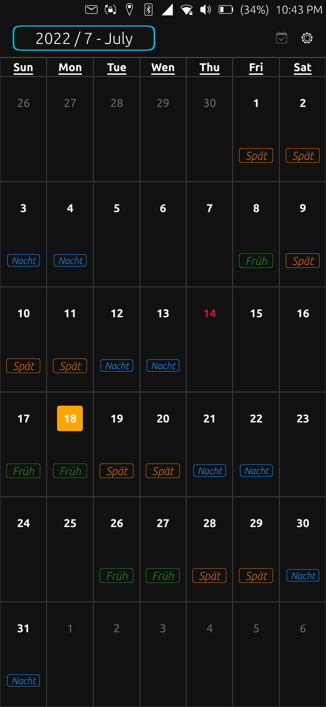
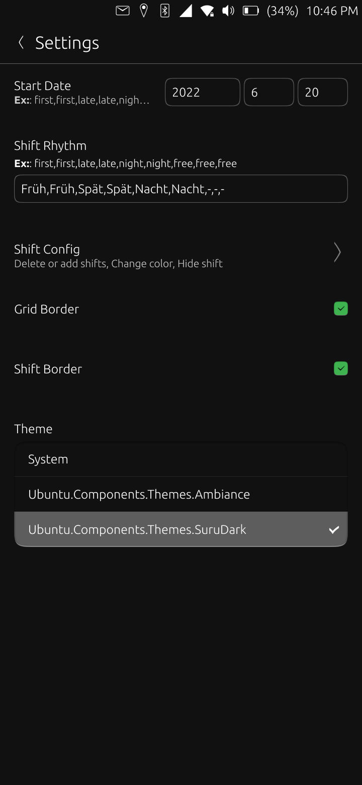
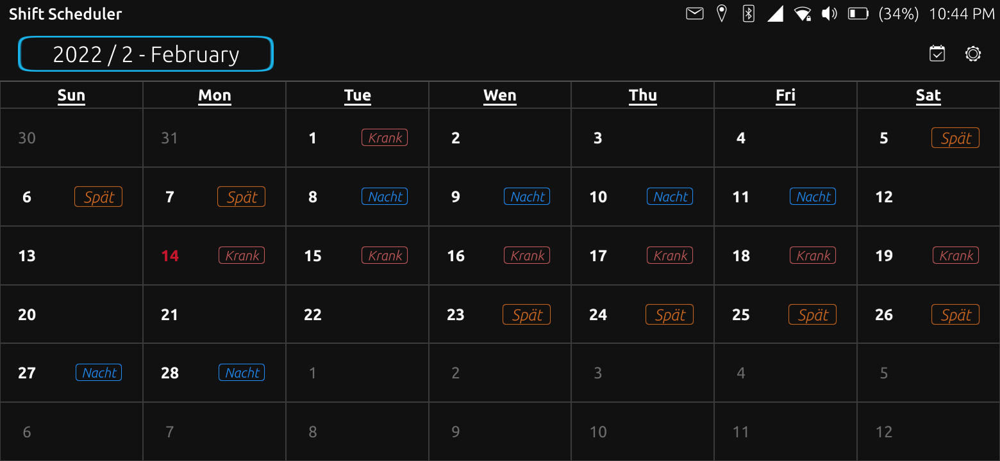

# Shift Scheduler


[](https://open-store.io/app/shift-scheduler.knackwurstking)

A simple shift scheduler app for ubuntu touch phones (ubports).



<br />


## Getting started

This project was build using [clickable](https://clickable-ut.dev/en/latest/)

```Bash
git clone https://gitlab.com/knackwurstking/shift-scheduler.git
cd shift-scheduler
clickable --arch arm64 # or armhf or amd64
```

## License

Copyright (C) 2022  Udo Bauer

This program is free software: you can redistribute it and/or modify it under
the terms of the GNU General Public License version 3, as published by
the Free Software Foundation.

This program is distributed in the hope that it will be useful, but WITHOUT ANY
WARRANTY; without even the implied warranties of MERCHANTABILITY, SATISFACTORY
QUALITY, or FITNESS FOR A PARTICULAR PURPOSE.
See the GNU General Public License for more details.

You should have received a copy of the GNU General Public License along with
this program.  If not, see <http://www.gnu.org/licenses/>.
